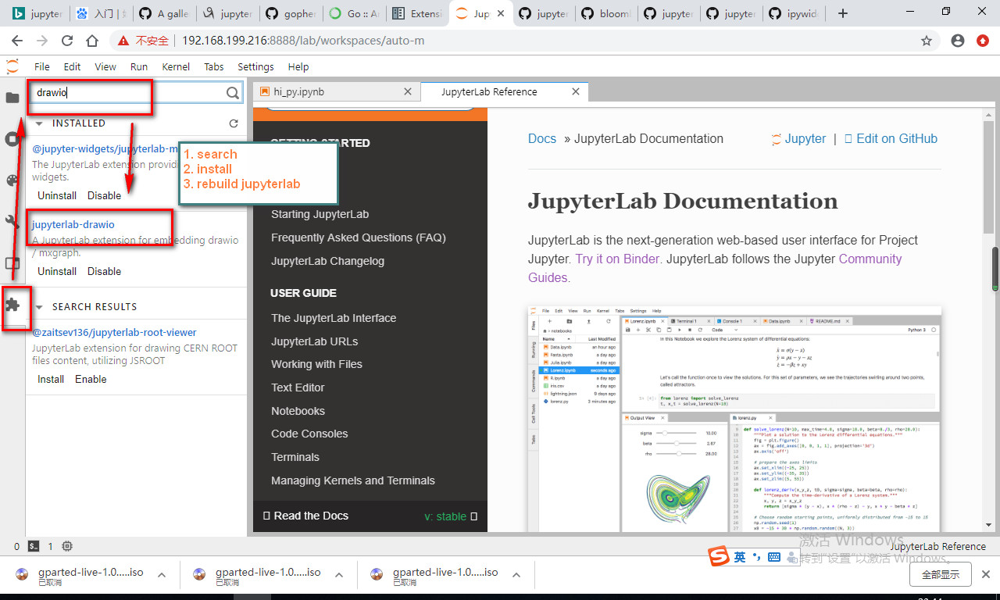
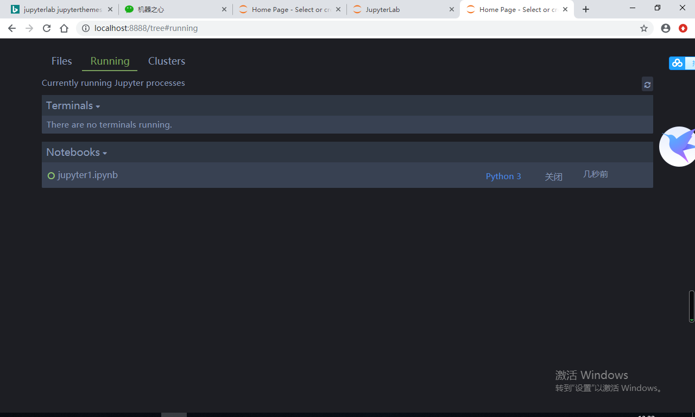

## 1. Original jupyter notebook


##  2. jupyterlab


https://jupyter.org/install.html

```bash
(py37) [root@localhost ~]# conda install  jupyterlab
Collecting package metadata (current_repodata.json): done
Solving environment: done
......
## Package Plan ##

  environment location: /root/anaconda3/envs/py37

  added / updated specs:
    - jupyterlab
......
The following packages will be SUPERSEDED by a higher-priority channel:

  ca-certificates                                 pkgs/main --> anaconda/pkgs/main
  certifi                                         pkgs/main --> anaconda/pkgs/main
  openssl                                         pkgs/main --> anaconda/pkgs/main


Proceed ([y]/n)? y
......

(py37) [root@localhost ~]# jupyter lab
[I 23:03:17.245 LabApp] The port 8888 is already in use, trying another port.
[I 23:03:17.251 LabApp] JupyterLab extension loaded from /root/anaconda3/envs/py37/lib/python3.7/site-packages/jupyterlab
[I 23:03:17.251 LabApp] JupyterLab application directory is /root/anaconda3/envs/py37/share/jupyter/lab
[C 23:03:17.252 LabApp] Running as root is not recommended. Use --allow-root to bypass.
(py37) [root@localhost ~]# jupyter lab --allow-root
[I 23:03:25.873 LabApp] The port 8888 is already in use, trying another port.
[I 23:03:25.880 LabApp] JupyterLab extension loaded from /root/anaconda3/envs/py37/lib/python3.7/site-packages/jupyterlab
[I 23:03:25.880 LabApp] JupyterLab application directory is /root/anaconda3/envs/py37/share/jupyter/lab
[I 23:03:25.882 LabApp] Serving notebooks from local directory: /root
[I 23:03:25.882 LabApp] The Jupyter Notebook is running at:
[I 23:03:25.882 LabApp] http://192.168.199.168:8889/
......

```


### 启用Extension Manager


* jupyterlab extensions

https://jupyterlab.readthedocs.io/en/stable/user/extensions.html#


- some extension need nodejs, such as drawio, lab extenstion manager

  Install nodejs using conda

  - windows
    

  

  - centos

```basic
(py37) [root@localhost ~]# conda install nodejs
Collecting package metadata (current_repodata.json): done
Solving environment: done

## Package Plan ##

  environment location: /root/anaconda3/envs/py37

  added / updated specs:
    - nodejs
    

The following packages will be downloaded:

    package                    |            build
    ---------------------------|-----------------
    nodejs-10.13.0             |       he6710b0_0        13.0 MB  https://mirrors.tuna.tsinghua.edu.cn/anaconda/pkgs/main
    ------------------------------------------------------------
                                           Total:        13.0 MB

The following NEW packages will be INSTALLED:

  nodejs             anaconda/pkgs/main/linux-64::nodejs-10.13.0-he6710b0_0


Proceed ([y]/n)? y


Downloading and Extracting Packages
nodejs-10.13.0       | 13.0 MB   | ##################################### | 100%

```


```bash
(py-jupyter) D:\ws\python\jupyter>node --version
v10.13.0

(py-jupyter) D:\ws\python\jupyter>jupyter labextension
Please supply at least one subcommand: check, disable, enable, install, link, list, uninstall, unlink, update

(py-jupyter) D:\ws\python\jupyter>jupyter labextension list
JupyterLab v1.0.4
No installed extensions
```


### jupyterlab-drawio

直接安装 failed

```bash
jupyter labextension install jupyterlab-drawio
```

源码安装 failed

```bash
npm install
npm run build
jupyter labextension link .

# Then
npm run build
jupyter lab build

```


```bash
(py-jupyter) D:\ws\python\jupyter>jupyter labextension install jupyter-drawio
An error occured.
ValueError: Please install nodejs 5+ and npm before continuing installation. nodejs may be installed using conda or directly from the nodejs website.
See the log file for details:  C:\Users\ADMINI~1\AppData\Local\Temp\jupyterlab-debug-h4kmjfoj.log
```


https://yarnpkg.com/lang/en/docs/install/#centos-stable

```bash
(py37) [root@localhost jupyterlab-drawio]# conda install -c conda-forge nodejs yarn
```

"-c conda-forge" is the key.

or:

```bash
curl --silent --location https://dl.yarnpkg.com/rpm/yarn.repo | sudo tee /etc/yum.repos.d/yarn.repo
yum install nodejs yarn

```


使用Extension Manager安装drawio更方便




### Interactive Widgets for the Jupyter Notebook

https://github.com/jupyter-widgets/ipywidgets

使用Extension Manager安装，简单方便


似乎还是需要运行命令安装


```bash
conda install -c conda-forge ipywidgets
```

pip install 更快

```bash
(py373-jpt) [root@localhost py-jpt]# https://github.com/jupyter-widgets/ipywidgets.git
(py373-jpt) [root@localhost py-jpt]# cd ipywidgets
(py373-jpt) [root@localhost ipywidgets]# pip install -e .
```

ok


​	

Examples of custom widget libraries built upon ipywidgets are

- [bqplot](https://github.com/bloomberg/bqplot) a 2d data visualization library enabling custom user interactions.

- [pythreejs](https://github.com/jovyan/pythreejs) a Jupyter - Three.js wrapper, bringing Three.js to the notebook.

- [ipyleaflet](https://github.com/ellisonbg/ipyleaflet) a leaflet widget for Jupyter.

  

#### a) bgplot

https://github.com/bloomberg/bqplot

* 同样使用git clone, pip 的方式安装，然后运行example

```bash

(py373-jpt) [root@localhost ~]# git clone https://github.com/bloomberg/bqplot
(py373-jpt) [root@localhost ~]# pip install bqplot
(py373-jpt) [root@localhost ~]# jupyter labextension install bqplot
Building jupyterlab assets

```

* This package depends on the following packages:

  ```bash
    ipywidgets (version >=7.0.0, <8.0)
    traitlets (version >=4.3.0, <5.0)
    traittypes (Version >=0.2.1, <0.3)
    numpy
    pandas
  ```

* issue: Error displaying widget: model not found

 https://stackoverflow.com/questions/57028962/jupyter-matplotlib-error-displaying-widget-model-not-found

  https://github.com/plotly/plotly.py/issues/1659

  https://plot.ly/python/getting-started/

  

#### b) pythreejs

https://github.com/jupyter-widgets/pythreejs

Need:

```bash
  conda install ipywebrtc
```


```bash
(py373-jpt) [root@localhost py-jpt]# git clone https://github.com/jupyter-widgets/pythreejs.git
(py373-jpt) [root@localhost py-jpt]# cd pythreejs/
(py373-jpt) [root@localhost pythreejs]# pip install -e .
......
Running setup.py develop for pythreejs
    ERROR: Complete output from command /root/anaconda3/envs/py373-jpt/bin/python -c 'import setuptools, tokenize;__file__='"'"'/root/py-jpt/pythreejs/setup.py'"'"';f=getattr(tokenize, '"'"'open'"'"', open)(__file__);code=f.read().replace('"'"'\r\n'"'"', '"'"'\n'"'"');f.close();exec(compile(code, __file__, '"'"'exec'"'"'))' develop --no-deps:
  ERROR: setup.py entered
......
# 源码安装有问题，不纠结，暂时略过，换方式
(py373-jpt) [root@localhost pythreejs]# pip install pythreejs
......
Successfully installed pythreejs-2.1.1

```

安装扩展

```bash
# for nbextenstion
(py373-jpt) [root@localhost ipyleaflet]# jupyter nbextension install --py --sys-prefix pythreejs
Installing /root/anaconda3/envs/py373-jpt/lib/python3.7/site-packages/pythreejs/static 
.....
    To initialize this nbextension in the browser every time the notebook (or other app) loads:

          jupyter nbextension enable pythreejs --py --sys-prefix

(py373-jpt) [root@localhost ipyleaflet]# jupyter nbextension enable --py --sys-prefix pythreejs
Enabling notebook extension jupyter-threejs/extension...
      - Validating: OK
(py373-jpt) [root@localhost ipyleaflet]#

# for jupyter lab
(py373-jpt) [root@localhost ipyleaflet]# jupyter labextension install jupyter-threejs
Building jupyterlab assets                                                              (py373-jpt) [root@localhost ipyleaflet]#

```


  

  

#### c) ipyleaflet
https://github.com/jupyter-widgets/ipyleaflet

```bash
(py373-jpt) [root@localhost ipyleaflet]# git clone https://github.com/jupyter-widgets/ipyleaflet
(py373-jpt) [root@localhost ipyleaflet]# pip install ipyleaflet
Collecting ipyleaflet
......
Successfully installed branca-0.3.1 ipyleaflet-0.11.1 pandas-0.25.0 pytz-2019.1 xarray-0.12.3
(py373-jpt) [root@localhost ipyleaflet]# jupyter nbextension enable --py --sys-prefix ipyleaflet
Enabling notebook extension jupyter-leaflet/extension...
      - Validating: OK
(py373-jpt) [root@localhost ipyleaflet]# jupyter labextension install jupyter-leaflet
Building jupyterlab assets
```


### itk-jupyter-widgets

https://github.com/InsightSoftwareConsortium/itk-jupyter-widgets

Need:

```bash
(py37) [root@localhost ~]# conda install -c conda-forge  pyimagej
```


```bash
(py373-jpt) [root@localhost py-jpt]# git clone https://github.com/InsightSoftwareConsortium/itk-jupyter-widgets.git
# 和下面的install 无关，clone 只为运行demo
......
(py373-jpt) [root@localhost py-jpt]# pip install itkwidgets
Collecting itkwidgets
......
Successfully built pycparser
Installing collected packages: pycparser, cffi, zstandard, ipympl, scipy, itk-core, itk-numerics, itk-filtering, param, pyct, colorcet, itkwidgets
Successfully installed cffi-1.12.3 colorcet-2.0.1 ipympl-0.3.3 itk-core-5.0.1 itk-filtering-5.0.1 itk-numerics-5.0.1 itkwidgets-0.17.1 param-1.9.1 pycparser-2.19 pyct-0.4.6 scipy-1.3.0 zstandard-0.11.1
(py373-jpt) [root@localhost py-jpt]# jupyter labextension install @jupyter-widgets/jupyterlab-manager itk-jupyter-widgets
An error occured.
ValueError: "/root/py-jpt/itk-jupyter-widgets" is not a valid npm package
See the log file for details:  /tmp/jupyterlab-debug-s_as2d_h.log
# 因为py-jpt目录下，有我刚才git clone的同名目录，报错，回到上一级目录即可
(py373-jpt) [root@localhost py-jpt]# cd ..
(py373-jpt) [root@localhost ~]# jupyter labextension install @jupyter-widgets/jupyterlab-manager itk-jupyter-widgets
Building jupyterlab assets
(py373-jpt) [root@localhost ~]#

```


## 3. jupyterthemes

```bash
(py-jupyter) D:\ws\python\jupyter>pip install jupyterthemes
Collecting jupyterthemes
......
6.0->jupyterthemes) (0.15.3)
Installing collected packages: kiwisolver, cycler, pyparsing, numpy, matplotlib, ply, lesscpy, jupyterthemes
Successfully installed cycler-0.10.0 jupyterthemes-0.20.0 kiwisolver-1.1.0 lesscpy-0.13.0 matplotlib-3.1.1 numpy-1.17.0 ply-3.11 pyparsing-2.4.1.1
(py-jupyter) D:\ws\python\jupyter>pip install --upgrade jupyterthemes
(py-jupyter) D:\ws\python\jupyter>jt -t onedork -fs 95 -altp -tfs 11 -nfs 115 -cellw 88% -T

(py-jupyter) D:\ws\python\jupyter>jupyter notebook
```


```bash
(py37) [root@localhost ~]# conda install jupyterthemes
```

```bash
# my two go-to styles
# dark
jt -t onedork -fs 95 -altp -tfs 11 -nfs 115 -cellw 88% -T
# light
jt -t grade3 -fs 95 -altp -tfs 11 -nfs 115 -cellw 88% -T
```


https://github.com/dunovank/jupyter-themes#command-line-examples


## 4. ipykernel

**Conda 环境自由切换**

```bash
# one
D:\ws\python\jupyter>conda activate py-jupyter

(py-jupyter) D:\ws\python\jupyter>pip install ipykernel

(py-jupyter) D:\ws\python\jupyter>python -m ipykernel install --user --name=py-jupyter
Installed kernelspec py-jupyter in C:\Users\Administrator\AppData\Roaming\jupyter\kernels\py-jupyter

# two
D:\ws\python\jupyter>conda create -n py-jpt python=3.7.3
Collecting package metadata (repodata.json): done
Solving environment: done
......
D:\ws\python\jupyter>conda activate py-jpt
(py-jpt) D:\ws\python\jupyter>pip install ipykernel
Collecting ipykernel
......
0 jedi-0.14.1 jupyter-client-5.3.1 jupyter-core-4.5.0 parso-0.5.1 pickleshare-0.7.5 prompt-toolkit-2.0.9 pygments-2.4.2 python-dateutil-2.8.0 pyzmq-18.0.2 six-1.12.0 tornado-6.0.3 traitlets-4.3.2 wcwidth-0.1.7

(py-jpt) D:\ws\python\jupyter>python -m ipykernel install --user --name=py-jpt
Installed kernelspec py-jpt in C:\Users\Administrator\AppData\Roaming\jupyter\kernels\py-jpt
```


## 5. nbextensions

```bash
(py-jupyter) D:\ws\python\jupyter>pip install jupyter_contrib_nbextensions
Collecting jupyter_contrib_nbextensions
......
Successfully installed jupyter-contrib-core-0.3.3 jupyter-contrib-nbextensions-0.5.1 jupyter-highlight-selected-word-0.2.0 jupyter-latex-envs-1.4.6 jupyter-nbextensions-configurator-0.4.1 lxml-4.3.4 pyyaml-5.1.1

(py-jupyter) D:\ws\python\jupyter>jupyter contrib nbextension install --system
[I 15:05:18 InstallContribNbextensionsApp] jupyter contrib nbextension install --system
[I 15:05:18 InstallContribNbextensionsApp] Installing jupyter_contrib_nbextensions nbextension files to jupyter data directory
......
[I 15:05:20 InstallContribNbextensionsApp] --  Configuring nbconvert template path
[I 15:05:20 InstallContribNbextensionsApp] --  Configuring nbconvert preprocessors
[I 15:05:20 InstallContribNbextensionsApp] - Writing config: C:\ProgramData\jupyter\jupyter_nbconvert_config.json
[I 15:05:20 InstallContribNbextensionsApp] --  Writing updated config file C:\ProgramData\jupyter\jupyter_nbconvert_config.json

(py-jupyter) D:\ws\python\jupyter>jupyter notebook
[I 15:08:16.393 NotebookApp] The port 8888 is already in use, trying another port.
[I 15:08:16.427 NotebookApp] [jupyter_nbextensions_configurator] enabled 0.4.1
......

```


```bash
(py37) [root@localhost ~]# conda install jupyter_contrib_nbextensions
(py37) [root@localhost ~]# jupyter contrib nbextension install --system
```


- Table of Contents(2)：单击生成整个笔记本的目录，不同的 section 都有对应的超链接。
- Scratchpad：在我看来绝对是最好的扩展了。这是一个你可以在里面做代码实验的独立空间，不会干扰笔记本中的其他部分。
- Codefolding ：代码折叠，这个不需要做过多的解释。
- Hide Input All：隐藏所有的代码单元，同时保持所有的输出和 markdown 单元可见。如果你要向非技术人员解释你的结果，那么这就会是一个很有用的功能。
- Variable Inspector：将你从调试的忧伤中拯救出来，这与 Spyder IDE 中的变量检查窗口有些类似。
- Spellchecker：对 markdown 单元中的内容进行拼写检查。
- Zenmode：移除掉屏幕中杂乱无关的内容，以便你能够聚焦于重要的东西上，例如代码。
- Snippets Menu：从 list comprehension 到 pandas 以及它们之间的所有常用代码片段的一个很酷的集合。这是最好的部分？你可以修改窗口的小部件来添加你自己的定制片段。


## jupyter 外网访问

1.使用命令 jupyter notebook --generate-config 产生配置文件。

2.编辑配置文件jupyter_notebook_config.py，它在./jupyter目录里面。

3.使用vi编辑jupyter_notebook_config.py。

4.找到#c.NotebookApp.ip = 'localhost'，把#号去掉，localhost改成自己的ip地址。

重新启动jupyter，ip更改成功。

​        http://192.168.199.157:8888/?token=bd2442485f6dffbd83a631eca066ff982ce3190c2677fd36

* 防火墙

```bash
(py27-jpt) [root@localhost ~]# firewall-cmd --state
running
(py27-jpt) [root@localhost ~]# systemctl stop firewalld
(py27-jpt) [root@localhost ~]# firewall-cmd --state
not running
(py27-jpt) [root@localhost ~]# systemctl disable firewalld
Removed symlink /etc/systemd/system/multi-user.target.wants/firewalld.service.
Removed symlink /etc/systemd/system/dbus-org.fedoraproject.FirewallD1.service.
(py27-jpt) [root@localhost ~]# firewall-cmd --state
not running
```


* 用户名密码登录

http://www.qiuqingyu.cn/2017/05/15/%E5%9C%A8%E6%9C%8D%E5%8A%A1%E5%99%A8%E7%AB%AF%E5%8D%87%E7%BA%A7python%E5%B9%B6%E5%AE%89%E8%A3%85Jupyter/

```bash
[root@localhost py-jpt]# python3.7
Python 3.7.4 (default, Jul 29 2019, 14:41:04)
[GCC 4.8.5 20150623 (Red Hat 4.8.5-36)] on linux
Type "help", "copyright", "credits" or "license" for more information.

> > > from notebook.auth import passwd
> > > passwd()
> > > Enter password:
> > > Verify password:
> > > Passwords do not match.
> > > Enter password:
> > > Verify password:
> > > 'sha1:39ac3172e2bf:b15c657810ea0048a4ca1c4ea5d10fde7df018c6'

[root@localhost ~]# vi .jupyter/jupyter_notebook_config.py ^C

```

```
c.NotebookApp.ip = '192.168.199.168'
c.NotebookApp.password = u'sha1:39ac3172e2bf:b15c657810ea0048a4ca1c4ea5d10fde7df018c6'

```


Then

```bash

[root@localhost py-jpt]# jupyter notebook --allow-root
[I 19:36:05.848 NotebookApp] The port 8888 is already in use, trying another port.
[I 19:36:05.848 NotebookApp] The port 8889 is already in use, trying another port.
[I 19:36:05.885 NotebookApp] JupyterLab extension loaded from /usr/local/lib/python3.7/site-packages/jupyterlab
[I 19:36:05.885 NotebookApp] JupyterLab application directory is /usr/local/share/jupyter/lab
[I 19:36:05.887 NotebookApp] Serving notebooks from local directory: /root/py-jpt
[I 19:36:05.887 NotebookApp] The Jupyter Notebook is running at:
[I 19:36:05.887 NotebookApp] http://192.168.199.238:8890/
[I 19:36:05.887 NotebookApp] Use Control-C to stop this server and shut down all kernels (twice to skip confirmation).
[W 19:36:05.891 NotebookApp] No web browser found: could not locate runnable browser.

```


## Some commands

```bash
jupyter notebook
conda create -n py-jupyter python=3.7.3
conda info --env
conda activate py-jupyter
pip install jupyterlab
jupyter lab
jupyter lab --debug
jupyter lab build

jupyter labextension
# check, disable, enable, install, link, list, uninstall, unlink, update
jupyter labextension list


conda clean -p      //删除没有用的包
conda clean -t      //tar打包
conda clean -y -all //删除所有的安装包及cache
```


## Some resources

Jupyter Notebook界面也可以如此炫酷？有人把Notebook玩出了新花样
https://mp.weixin.qq.com/s/8H5uQZZ0Zd1uBhJx30vdxQ

只有想不到，「99」种扩展Jupyter功能的好方法
https://baijiahao.baidu.com/s?id=1637759984725766856&wfr=spider&for=pc

始于Jupyter Notebooks：一份全面的初学者实用指南

http://baijiahao.baidu.com/s?id=1601883438842526311&wfr=spider&for=pc

https://github.com/jupyter/jupyter/wiki/A-gallery-of-interesting-Jupyter-Notebooks


https://jupyterlab.readthedocs.io/en/stable/getting_started/installation.html


## pip 源

```bash
# 单次指定
$pip install jupyterlab -i https://pypi.tuna.tsinghua.edu.cn/simple
```

https://blog.csdn.net/chenghuikai/article/details/55258957

## check version

```bash
(base) [root@localhost ~]# conda --version
conda 4.7.10
(base) [root@localhost ~]# python --version
Python 3.7.3
(base) [root@localhost ~]# pip --version
pip 19.1.1 from /root/anaconda3/lib/python3.7/site-packages/pip (python 3.7)
(base) [root@localhost ~]# pip show pandas
Name: pandas
Version: 0.24.2
......

```


### jupyter shortcut key

https://jupyter-notebook.readthedocs.io/en/stable/notebook.html

key|description
---|---
 shift+enter |Run a code cell and then go to next cell
 ctrl+enter, command+enter |Run a code cell and enters command mode, (don't go to next cell)
 alt+enter |runs the current cell and inserts a new one below
 dd |delete cells
 x |cut cells
 c |copy cells
 v |paste cells below
 z |undo cell option
 s |save
 a |insert new cell before this cell, and go to the new cell
 b |insert new cell after this cell, and go to the new cell
 shift+z |redo cell option
 ctrl+b |show/hide left sidebar
 ctrl+f |search
 ctrl+g |search next
 ctrl+shift+g，（maybe +fn） |search previous
 shift+up(down) arrow |selected multiple row


## Different mode

Two modes:
* Command mode
    * press enter, enter edit mode
    
    * press "y", the cell turn to code text style
    
    * press "m", the cell turn to markdown text style
    
    * press "r", the cell turn to raw text style
    
      e.g. if I want edit the cell with code style, press "y", then press enter in the command mode.

    * press dd, delete the cell
    * press up/down arrow, goto up/down cell
    
* Edit mode
  
    * press esc, enter command mode
    
* They have the same usage in the two mode
    * press shift + enter, run this cell, and goto next cell with command mode.
    * press ctrl + enter, run this cell, and still stay at this cell.
    * press ctrl + enter, run this cell, and insert a new cell with edit mode with code style, 

https://blog.csdn.net/qq_35423500/article/details/79565146


## Run and load python file(.py), it the jupyter
* Run

  ```javascript
  %run xxx.py
  %run -i 'xxx.py'
  ```

* Load

  ```javascript
  %load xxx.py
  ```

  

  

https://www.bbsmax.com/A/MAzAOpPn59/

https://ipython.org/ipython-doc/3/interactive/magics.html#magic-run


## Debug in jupyter

```python
from IPython.core.debugger import set_trace

def debug(y):
    x = 10
    x = x + y 
    set_trace()
    for i in range(10):
        x = x+i
    return x

debug(10)
```


